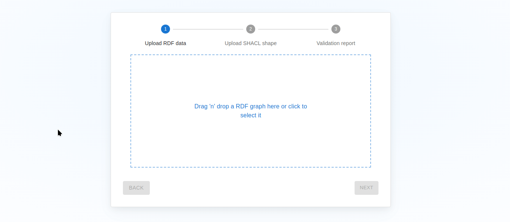

[![Language][language-badge]][typescript-url]
[![React][react-badge]][react-url]
[![Vite][vite-badge]][vite-url]
[![MIT License][license-badge]][license-url]
![OS][OS-badge]
![CPU][CPU-badge]
[](#)
[](#)
[](#)

<div align="center">
  <a href="https://github.com/Celestius101/rdf-validator-ui">
    
  </a>

  <p align="center">
    <b>A data validation UI for RDF using SHACL shapes</b>
  </p>
</div>

_RDF Validator_ is a user interface which improves the understandability and usability of [SHACL shapes][SCHACL-documentation] in the context of [RDF graph][RDF-documentation] validation. It provides an intuitive and easy way to validate RDF data by uploading both the data file and the SHACL shape resulting in a validation report that is clear and concise.

<div align="center">
  
</div>

## Table of Contents

- [Prerequisites](#prerequisites)
- [Installation](#installation)
- [Usage](#usage)
  - [Development](#development)
  - [Test](#test)
  - [Production](#production)
  - [Linting](#linting)
- [Deep dive](#deep_dive)
  - [Frontend](#frontend)
  - [Backend](#backend)
- [Troubleshooting](#troubleshooting)
- [License](#license)

## Prerequisites

- Docker 23.0 or higher **with BuildKit enabled**
- Yarn 1.22.x or higher || npm 10.8.x or higher
- Node 20.17.0 or lower ([js-dom issues](https://github.com/jsdom/jsdom/issues/3613))
- Windows, macOS, or Linux operating system
- A stable and good internet connection

## Installation

1. First download the project to a location of your liking

```sh
git clone https://github.com/Celestius101/rdf-validator-ui.git
```

2. Then install the needed dependencies for the frontend using your favorite package manager (mine is `yarn`)

```sh
cd frontend
yarn install
```

3. Do the same for the backend

```sh
cd backend
yarn install
```

4. You're good to go!

## Usage

The project proposes a few scripts to develop on it, run unit tests on your code, build it for prod or lint all the files to a coherent codestyle with eslint/prettier.

### Development

This is the simplest way to quickly use the application or to develop on it.

By using `yarn dev`, you can easily setup a dev server accessible on your browser at [http://localhost:5173](http://localhost:5173).

This makes use of the ultra fast HMR dev server provided by Vite, reloading only relevant modified elements without needing to restart the server between code changes.

:warning: Make sure to launch both the frontend and backend dev server for them to interact properly (the backend will listen on `http://localhost:3000`). :warning:

### Tests

The frontend possesses units tests that you can run with `yarn test` while being in the `frontend` folder.

### Production

You can also build production ready code by doing `yarn build` on both the backend and the frontend.

You will then obtain your javascript code (transpiled from typescript) in a `dist` directory (in each respective backend and frontend directory).
From there, you can serve the frontend with `nginx` for instance and the backend with `node`.

### Linting

If for some reasons your IDE isn't autoconfigured with the eslint config files or you want to do it in the CI, you can align the codestyle of all your files by doing `yarn lint`.

Note that the linting is only configured for the frontend.

## Deep dive

Here is the part where I get slightly more technical, delve deeper into the technology used and explain into more details the what, how and why.

### Frontend

The frontend is a single page application (SPA) using React for its rendering.

The trend, in such cases, can be to use CRA (create-react-app) as a bundler/tooling but recently it has been lacking behind in term of releases and leveraging the new features offered by the different browsers. And I'm not even talking about the memory leaks provoked by Jest which it often comes with.

That's why I went for [Vite][vite-url], a next-generation frontend bundling toolkit. From experience, it's an enhancement in the following aspects :

- It's providing a faster dev server with HMR
- The bundling size tends to be smaller
- The associated testing framework, [vitest][vitest-url] is more intuitive and again...faster
- It's strengthened by a whole growing ecosystem of plugins
- And more...

Regarding everything related to querying the backend, instead of the simple `fetch` I make use of [axios][axios-url] which is notably better in term of the features provided to manage HTTP requests. The builder approach to constructing a request is also more intuitive.

More importantly, when traversing the validation report returned by the backend, I initially wanted to use [grapoi][grapoi-url], a new library for RDF graph traversing. Unfortunately, I had trouble using it for Blank node (which the validation report is) and ended up using an older relatively similar framework called [clownface :clown_face:][clownface-url]. This is at the center of how I easily deconstruct the data from the validation report rather than create a godawful way to parse it myself.

Finally and just for giving props to a nice project, I use [react-query][react-query-url] for everything related to asynchronous state management. Whereas some people might use `redux` for such things, I find far easier and satisfying to use `react-query`, even when considering `redux toolkit`.
Rather than working with a store, actions and all the painful objects you need to manage your application state, you now have a simple key associated to a function (often an API call).
`react-query` manages everything for you behind the scene. The staleness of your data, the triggering of the API call again if need be and the replacement of the value. You just need to care for your value through a hook.
Unfortunately this project only features the concept of "mutations", the modification of a backend resource.

### Backend

The backend is a simple `node` server that wraps around the TopQuadrant API provided under the form of a docker image.

In order to minimize the actions required by the user, I also leveraged [dockerode][dockerode-url] in order to build the image directly before the launch of the server.
`dockerode` is essentially a bridge between node and your docker daemon.
It is used in this context to execute the following instructions :

1. Pull the image `alpine:3.18`
2. Pull the image `eclipse-temurin:11-alpine` for `x86` or `amazoncorretto:11-alpine3.18-jdk` for `arm` processors
3. Check whether the `ghcr.io/topquadrant/shacl:1.4.3` is already present building it if needed.
4. Upon receiving a `POST` request on `/validate`, transmits the received file for validation to the aforementioned built image.

## Troubleshooting

#### Firefox : CORS request did not succeed. Status code: (null).

While not optimal and in need of improvement security-wise, the server is currently setup to handle CORS from all origins for simplicity.
However, a weird bug makes it so that requests taking too long will get dropped in Firefox and show up as a CORS error even though the server is configured properly to handle that.
In our context, due to the nesting of docker image in our server and the already time consuming process that is the validation, a request usually takes (depending on the server specs) between 5 - 10 seconds.

To solve this you need to go in your firefox config by typing `about:config` in the URL field.
Then look for a property called `network.http.network-changed.timeout` which by default is set to 5. Change that value to 15 to be safe.
Your requests shouldn't get dropped anymore.

## License

This project is distributed under a free MIT license. You can review the full license agreement [here](./LICENSE).

<!-- MD reference style links -->

[language-badge]: https://img.shields.io/badge/Language-TypeScript-blue
[typescript-url]: https://www.typescriptlang.org/
[vite-badge]: https://img.shields.io/static/v1?message=Vite&logo=vite&labelColor=5c5c5c&color=646CFF&logoColor=white&label=%20
[vite-url]: https://vitejs.dev/
[react-badge]: https://img.shields.io/static/v1?message=React&logo=react&labelColor=5c5c5c&color=1182c3&logoColor=white&label=%20
[react-url]: https://react.dev/
[license-badge]: https://img.shields.io/badge/License-MIT-B20D35
[license-url]: https://github.com/Celestius101/rdf-validator-ui/blob/main/LICENSE
[OS-badge]: https://img.shields.io/badge/OS-linux%2C%20windows%2C%20macOS-bbbbbb
[CPU-badge]: https://img.shields.io/badge/CPU-x86%2C%20x64%2C%20ARM%2C%20ARM64-FF8C00
[RDF-documentation]: https://docs.stardog.com/tutorials/rdf-graph-data-model
[SCHACL-documentation]: https://www.w3.org/TR/shacl/
[grapoi-url]: https://github.com/rdf-ext/grapoi
[clownface-url]: https://github.com/zazuko/clownface
[axios-url]: https://axios-http.com/docs/intro
[react-query-url]: https://tanstack.com/query/v3
[vitest-url]: https://vitest.dev/
[dockerode-url]: https://github.com/apocas/dockerode
